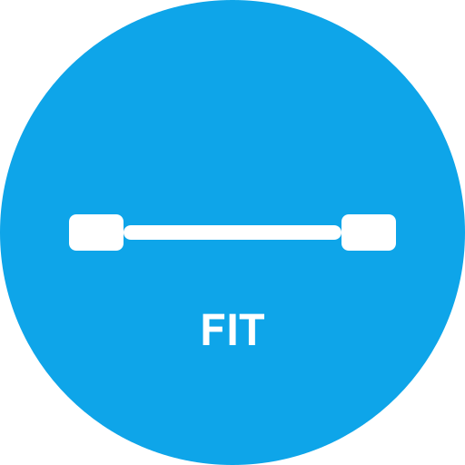

# FIT - Progressive Web App per Allenamenti Fitness



Una PWA completa per allenamenti fitness con timer, schede personalizzate e AI coach. Funziona completamente offline e può essere installata su qualsiasi dispositivo.

## ✨ Caratteristiche

### 📱 PWA Completa
- **Installabile**: Aggiungi alla home screen come app nativa
- **Offline Functionality**: Funziona senza connessione internet
- **Push Notifications**: Notifiche per promemoria allenamenti
- **Responsive Design**: Ottimizzata per mobile e desktop

### 💪 Menu Allenamento
- Visualizzazione e selezione schede allenamento
- Esecuzione allenamenti con interfaccia step-by-step
- Sistema note per ogni esercizio (peso, ripetizioni, sensazioni)
- Tracciamento progresso durante l'allenamento
- Navigazione intuitiva tra esercizi

### ⏱️ Sistema Cronometri
- **Timer Singolo**: Per riposo tra le serie
- **Timer Multipli**: Sequenziali per protocolli complessi
- **Preset Timer**:
  - Tabata (20s lavoro, 10s riposo)
  - HIIT personalizzabile
  - Circuit Training
- **Timer Personalizzabili**: Adatta ogni parametro alle tue esigenze
- **Notifiche e Vibrazione**: Feedback tattile e sonoro

### 📝 Menu Creazione Scheda
- **CRUD Completo**: Create, Read, Update, Delete schede
- **Database Ricercabile**: 150+ esercizi precaricati
- **Filtri Avanzati**: Per gruppo muscolare, attrezzatura, difficoltà
- **Drag & Drop**: Riordina esercizi facilmente
- **Esercizi Personalizzati**: Aggiungi i tuoi esercizi
- **Import/Export**: Condividi schede in formato JSON

### 🤖 AI Coach
- **Chat Interface**: Interazione naturale con l'AI
- **Schede Personalizzate**: Generate basate su:
  - Obiettivi (forza, ipertrofia, definizione, resistenza)
  - Livello esperienza
  - Tempo disponibile
  - Attrezzatura disponibile
- **Cache Intelligente**: Riduce chiamate API
- **Fallback Templates**: Funziona anche senza connessione

### ⚙️ Menu Impostazioni
- **Tema Scuro/Chiaro**: Adatta l'app alle tue preferenze
- **Timer Default**: Imposta i tuoi valori preferiti
- **Gestione Backup**: Esporta e importa tutti i tuoi dati
- **Lingua e Unità**: Personalizza l'esperienza
- **Privacy**: Controllo completo sui tuoi dati

## 🚀 Installazione

### Requisiti
- Node.js 18+
- npm o yarn

### Installazione locale
```bash
# Clona il repository
git clone https://github.com/tuonome/fitness-pwa.git
cd fitness-pwa

# Installa le dipendenze
npm install

# Avvia il server di sviluppo
npm run dev
```

### Build per produzione
```bash
# Build dell'applicazione
npm run build

# Anteprima della build
npm run preview
```

## 🛠️ Stack Tecnologico

- **Frontend**: React 18 + TypeScript
- **Styling**: Tailwind CSS
- **Routing**: React Router v6
- **Database**: IndexedDB con Dexie
- **PWA**: Service Workers + Workbox
- **State Management**: React Hooks
- **Animations**: Framer Motion
- **Icons**: Lucide React
- **Notifications**: React Hot Toast
- **Build Tool**: Vite

## 📁 Struttura del Progetto

```
FIT/
├── src/
│   ├── components/          # Componenti riutilizzabili
│   │   ├── BackupManager.tsx
│   │   ├── ExerciseSelector.tsx
│   │   ├── TimerDisplay.tsx
│   │   └── WorkoutSession.tsx
│   ├── hooks/              # Custom hooks
│   │   ├── useAI.ts
│   │   ├── useBackup.ts
│   │   ├── useTheme.ts
│   │   └── useTimer.ts
│   ├── pages/              # Pagine dell'app
│   │   ├── HomePage.tsx
│   │   ├── WorkoutsPage.tsx
│   │   ├── CreateWorkoutPage.tsx
│   │   ├── AICoachPage.tsx
│   │   ├── SettingsPage.tsx
│   │   └── TimerPage.tsx
│   ├── db/                 # Database e modelli
│   │   └── index.ts
│   ├── types/              # TypeScript types
│   │   └── index.ts
│   ├── utils/              # Funzioni utility
│   ├── App.tsx             # Componente principale
│   ├── main.tsx            # Entry point
│   └── index.css           # Stili globali
├── public/
│   ├── sw.js              # Service Worker
│   ├── manifest.json      # PWA Manifest
│   └── assets/            # Risorse statiche
└── package.json           # Dipendenze e script
```

## 🎯 Esercizi Disponibili

La app include 150+ esercizi suddivisi per gruppi muscolari:

- **Petto**: Panca piana, inclinata, declinata, croci, flessioni, dips
- **Schiena**: Trazioni, rematore, lat machine, stacchi, pulley
- **Spalle**: Alzate laterali, frontali, posteriori, military press
- **Braccia**: Curl bicipiti, estensioni tricipiti, hammer curl
- **Gambe**: Squat, leg press, affondi, stacchi rumeni, polpacci
- **Core**: Plank, crunch, russian twist, leg raise, mountain climber
- **Stretching**: Per ogni gruppo muscolare, dinamico e statico
- **Cardio**: Corsa, cyclette, rowing, burpees, jumping jack

## 🔧 Configurazione

### API Key per AI (Opzionale)
Per abilitare le funzionalità AI avanzate:

1. Vai nelle Impostazioni > Integrazione AI
2. Inserisci la tua API key per Gemini
3. Abilita "Usa AI per generare schede"

### Personalizzazione Timer
I timer possono essere completamente personalizzati:
- Tempo di lavoro e riposo
- Numero di round e cicli
- Tempo di preparazione
- Suoni e vibrazione

## 🌐 PWA Features

### Installazione
1. Apri l'app nel browser Chrome/Safari
2. Cerca l'icona di installazione nella barra degli indirizzi
3. Clicca "Installa" o "Aggiungi alla home screen"

### Offline Mode
Una volta installata, l'app funziona completamente offline:
- Tutti i dati sono salvati localmente
- Le schede e gli esercizi sono disponibili offline
- I timer funzionano senza connessione

### Share Target
L'app supporta la condivisione di:
- Schede di allenamento
- Progressi
- Timer personalizzati

## 🤝 Contributi

I contributi sono benvenuti! Per favore:

1. Forka il repository
2. Crea un feature branch (`git checkout -b feature/amazing-feature`)
3. Commit le tue modifiche (`git commit -m 'Add amazing feature'`)
4. Pusha al branch (`git push origin feature/amazing-feature`)
5. Apri una Pull Request

## 📄 Licenza

Questo progetto è sotto licenza MIT - vedi il file [LICENSE](LICENSE) per i dettagli.

## 🙏 Ringraziamenti

- [React](https://reactjs.org/) - Libreria UI
- [Tailwind CSS](https://tailwindcss.com/) - Framework CSS
- [Dexie](https://dexie.org/) - IndexedDB wrapper
- [Lucide](https://lucide.dev/) - Icon library
- [Vite](https://vitejs.dev/) - Build tool

## 📞 Supporto

Per supporto o domande:
- Apri un issue su GitHub
- Contatta lo sviluppatore
- Unisciti alla community Discord

---

**Costruito con ❤️ per la community fitness**